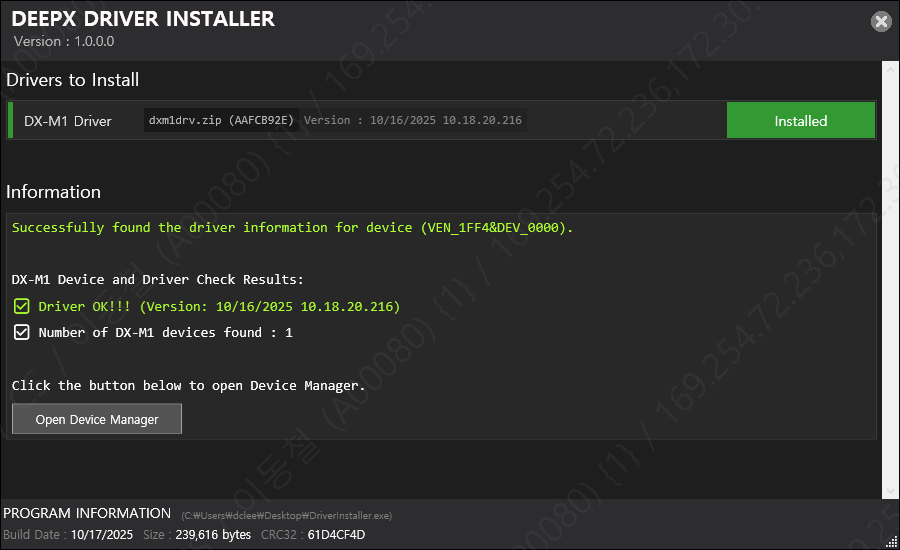
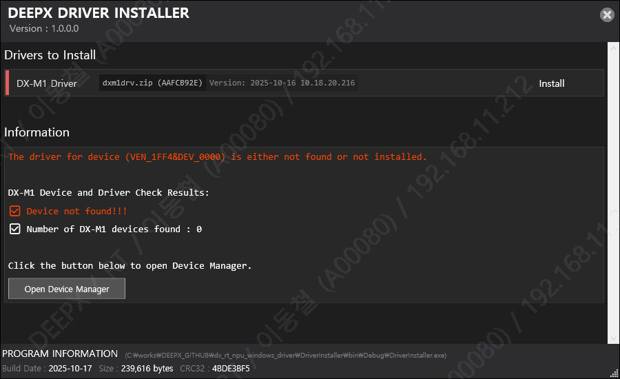

This chapter provides an overview of the DEEPX SDK architecture and explains each core component and its role in the AI development workflow.  

---

## DEEPX SDK Architecture  

<div class="center-text">
<p align="center">
  
<br>
Figure. DEEPX SDK Architecture  
<br><br>
</p>
</div>

**DEEPX SDK** is an all-in-one software development platform that streamlines the process of compiling, optimizing, simulating, and deploying AI inference applications on DEEPX NPUs (Neural Processing Units). It provides a complete toolchain, from AI model creation to runtime deployment, optimized for edge and embedded systems, enabling developers to build high-performance AI applications with minimal effort.

---

## Inference Flow of DX-RT

Here is the inference flow of **DX-RT**.

<div class="center-text">
<p align="center">
  
<br>
Figure. Inference Flow of DXNN Runtime  
<br><br>
</p>
</div>

This figure illustrates the inference workflow of the DXNN Runtime SDK, which integrates OpenCV-based input/output handling with efficient NPU-accelerated model execution.

**Model Execution**  
The InferenceEngine is the core component of the DXNN Runtime SDK. It:  
- Initializes and controls the NPU device
- Manages memory for input/output tensors
- Schedules inference tasks across NPU and CPU, optimizing their interaction for real-time performance

```
$ cd dx_rt
$ ./install.sh --all
```
---